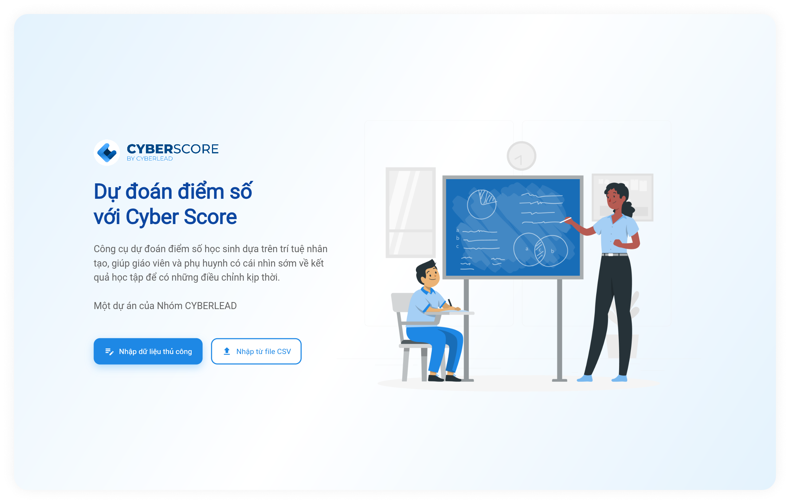
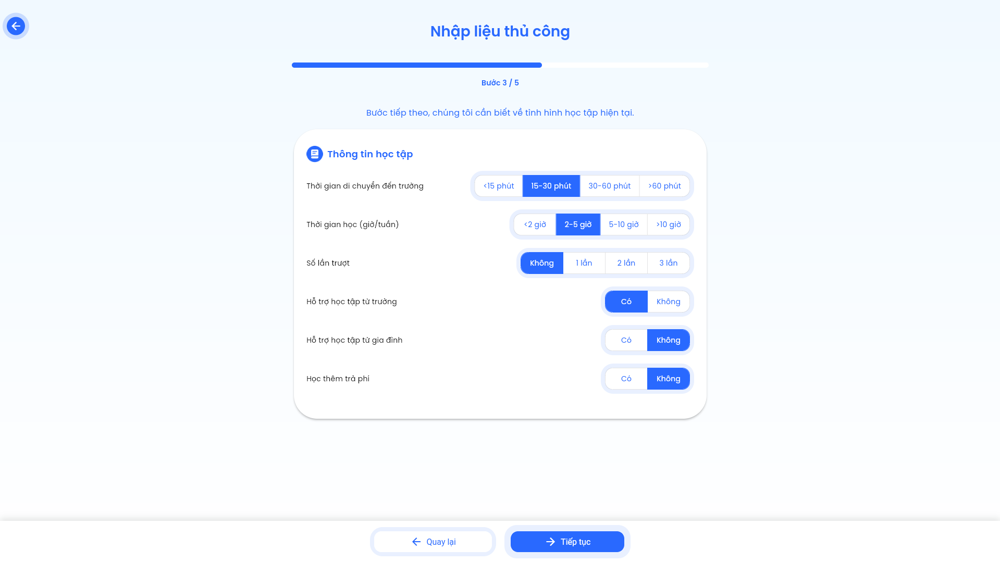
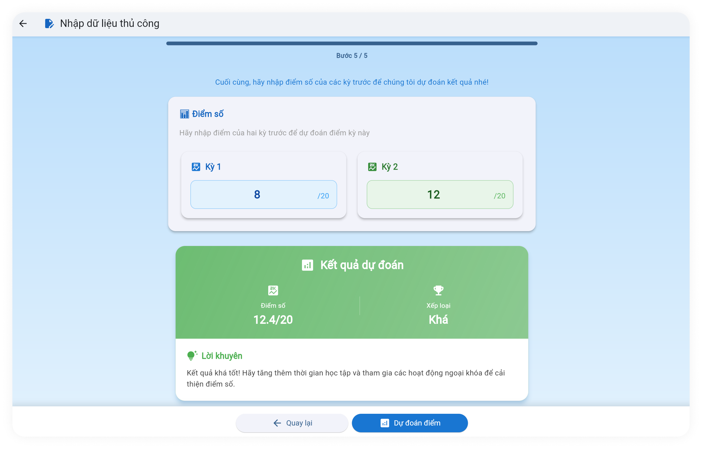
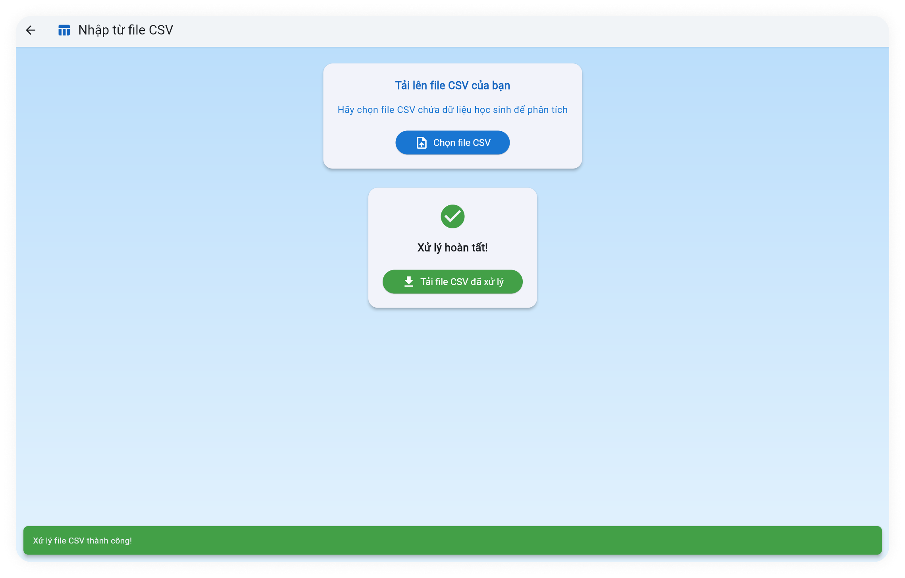

# CyberScore - Ứng dụng AI dự đoán điểm số sinh viên

CyberScore là một webapp, sử dụng trí tuệ nhân tạo (AI) để hỗ trợ giáo viên và sinh viên dự đoán điểm số học tập của sinh viên. Ứng dụng có mục tiêu giúp người dùng có cái nhìn sớm về kết quả học tập, từ đó đưa ra những điều chỉnh kịp thời trong quá trình giảng dạy và học tập.

## 🎯 Mục Tiêu Của Ứng Dụng

- 🧠 **Dự Đoán Điểm Số:** Sử dụng mô hình Machine Learning để đưa ra dự đoán chính xác về điểm số của sinh viên.
- 📈 **Cung Cấp Thông Tin Sớm:** Cung cấp thông tin điểm số trước kỳ thi để giáo viên và sinh viên.
- 👩‍🏫 **Hỗ Trợ Giáo Viên và Sinh Viên:** Giúp theo dõi sự tiến bộ của sinh viên một cách dễ dàng và hiệu quả.

---

## 🚪 Tính Năng Chính

- ✏️ **Nhập dữ liệu thủ công** hoặc từ file CSV.
- 🎨 **Giao diện hiện đại** dựa trên tiêu chuẩn Material Design.
- 🌍 **Tương thích đa nền tảng**, hoạt động trên Web, Android, iOS, Windows, Linux và macOS.
- 💻 **Animation mượt mà**, dễ sử dụng.
- 🔮 **Tích hợp AI** cho phép dự đoán điểm số sinh viên.

---

## 🖼️ Ảnh Chụp Màn Hình

Dưới đây là một số ảnh chụp màn hình của ứng dụng:

### Màn Hình Chính


### Màn Hình Nhập Dữ Liệu


### Màn Hình Dự Đoán


### Màn Hình Kết Quả


---

## 👥 Tác Giả

- **Lê Tuấn Anh (2274801030005)**
- **Trần Tuấn Anh (2274801030009)**
- **Bùi Thảo Duyên (2274801030026)**

**Lớp:** K28KTPM03 - Trường Đại Học Văn Lang 🎓

---

## 🛠️ Công Nghệ Sử Dụng

### Frontend

- **🖼️ Flutter/Dart:** Framework chính cho giao diện đa nền tảng.
- **🎨 Material Design:** Thiết kế UI tối ưu cho trải nghiệm người dùng.
- **🔗 HTTP Package:** Kết nối với API backend.

### Backend

- **🐍 Python 3.8+:** Ngôn ngữ lập trình backend chính.
- **🍶 Flask:** Web framework nhẹ nhàng và tùy chỉnh.
- **🤖 Scikit-learn:** Thư viện máy học mạnh mẽ.
- **📊 Pandas & NumPy:** Xử lý và phân tích dữ liệu.
- **📦 Joblib:** Lưu và tải mô hình AI.

---

## 🔧 Yêu Cầu Hệ Thống

### Frontend

- 🌐 **Flutter SDK:** Cài đặt phiên bản mới nhất từ [Flutter Official](https://flutter.dev/docs/get-started/install).
- 🛠️ **Dart SDK:** Tích hợp với Flutter.
- 🖥️ **IDE:** Visual Studio Code hoặc Android Studio.
- 🧰 **Git:** Quản lý mã nguồn.

### Backend

- 🐍 **Python 3.8 trở lên:** Cài đặt từ [Python Official](https://www.python.org/downloads/).
- 📦 **pip:** Python package manager.
- 📚 **Nhóm Thư Viện:**
  - flask
  - pandas
  - scikit-learn
  - joblib
  - numpy

---

## 📥 Hướng Dẫn Cài Đặt

### 1. **Cài Đặt Backend**

- **Bước 1:** Cài đặt **Python 3.8+** và **pip**.
- **Bước 2:** Tạo môi trường ảo:
  
    ```bash
    python -m venv venv
    source venv/bin/activate  # Linux/Mac
    venv\Scripts\activate     # Windows
    ```

- **Bước 3:** Cài đặt các thư viện cần thiết:
  
    ```bash
    pip install flask pandas scikit-learn joblib numpy
    ```

- **Bước 4:** Khởi động server:
  
    ```bash
    cd backend
    python app.py
    ```

### 2. **Cài Đặt Frontend**

- **Bước 1:** Cài đặt **Flutter SDK** và **Dart SDK** theo hướng dẫn chính thức từ [Flutter Official](https://flutter.dev/docs/get-started/install).
- **Bước 2:** Clone repository:
  
    ```bash
    git clone https://github.com/petervlu/DoAnUngDung_2
    cd doanlaptrinh
    ```

- **Bước 3:** Cài đặt dependencies cho dự án:
  
    ```bash
    flutter pub get
    ```

- **Bước 4:** Khởi chạy ứng dụng:
  
    ```bash
    flutter run
    ```

### 3. **Lưu Ý Quan Trọng**

- **Chạy Backend Trước:** Backend phải được chạy **trước** khi khởi động frontend để đảm bảo kết nối API hoạt động đúng.
- **File Mô Hình AI:** Đảm bảo file model AI (**decision_tree_model.pkl**) đã nằm trong thư mục `backend/models/`.
- **Kiểm Tra URL API:** Kiểm tra URL API trong frontend (mặc định là `http://localhost:5000`) và đảm bảo nó phù hợp với cấu hình backend của bạn.

---

## 📄 License

Dự án này được phát triển bởi nhóm CYBERLEAD (K28KTPM03) - Trường Đại Học Văn Lang.

## 📧 Liên Hệ

Nếu bạn có bất kỳ câu hỏi nào về dự án, vui lòng liên hệ với chúng tôi qua email:

- **Lê Tuấn Anh:** anh.2274801030005@vanlanguni.vn
- **Trần Tuấn Anh:** anh.2274801030009@vanlanguni.vn
- **Bùi Thảo Duyên:** duyen.2274801030026@vanlanguni.vn
